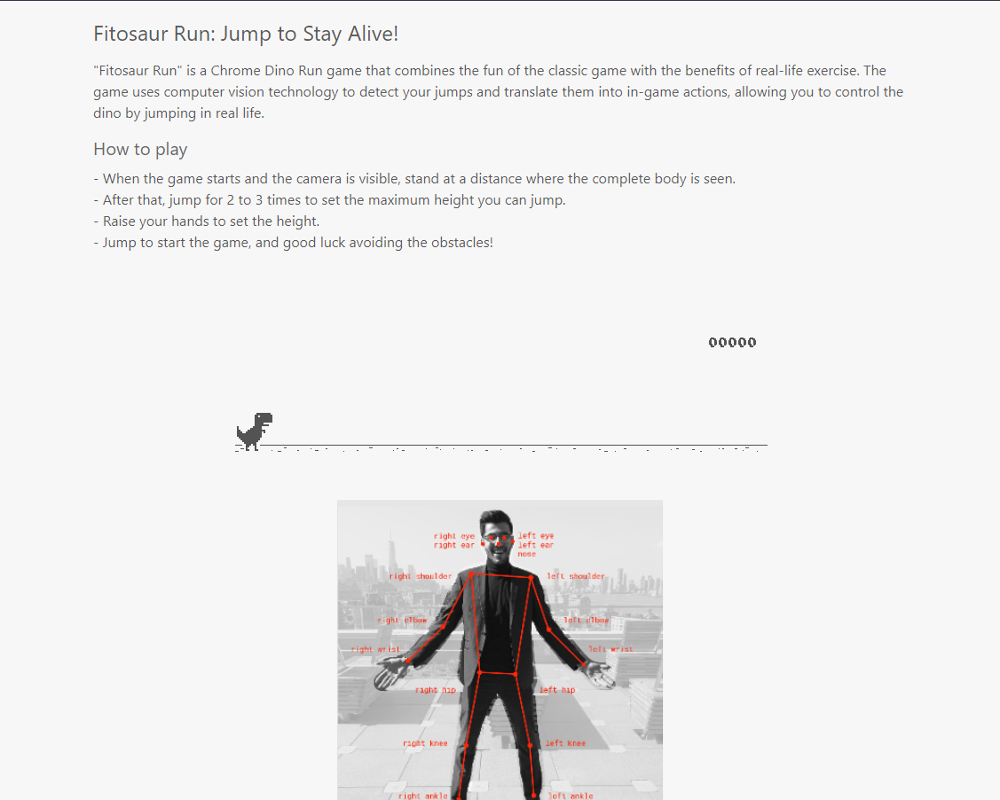

# Fitosaur Run: Jump to Stay Alive!


**Fitosaur Run** is a thrilling Chrome Dino Run game with a twist – it combines the excitement of the classic game with the benefits of real-life exercise. In this innovative game, computer vision technology detects your jumps and translates them into in-game actions, allowing you to control the dinosaur by jumping in real life!



## Introduction

The gameplay is simple yet challenging: jump over obstacles to stay alive and earn points. The longer you survive, the more points you accumulate. But don't underestimate the workout you'll get – you'll be jumping, squatting, and elevating your heart rate as you play.

## Tech Stack

Fitosaur Run is powered by a powerful tech stack, including:

- **Mediapipe**: For precise pose estimation.
- **Keras and TensorFlow**: For deep learning and model inference.
- **NumPy**: For numerical operations.
- **OpenCV-Python**: For computer vision and hand position tracking.
- **Flask**: For the web application framework.
- **PyCryptodome**: For secure token generation.
- **Pyrebase4**: For Firebase integration.
- **Requests**: For making HTTP requests.
- **Keyboard**: For simulating keyboard inputs.

## Installation

To run Fitosaur Run on your local machine, follow these steps:

1. Clone this repository using the following command:
   ```bash
   git clone https://github.com/adithya-s-k/Fitosaur-Run.git
   ```

2. Install the necessary Python dependencies by running the following command in the project's root directory:
   ```bash
   pip install -r requirements.txt
   ```

3. Start the game server by running the following command:
   ```bash
   python app.py
   ```

4. Open your web browser and navigate to [http://localhost:5000](http://localhost:5000).

5. When prompted, allow the app to access your webcam.

6. Use your body movements to control the Chrome Dino Game and start your fitness adventure!

## Preview


## Contribution

Contributions are welcome! If you'd like to contribute to the project, please follow these guidelines:

- Fork the repository on GitHub.
- Clone your forked repository to your local machine.
- Create a new branch for your feature or bug fix: `git checkout -b feature-name`.
- Make your changes and commit them: `git commit -m 'Add some feature'`.
- Push to the branch: `git push origin feature-name`.
- Create a new pull request on the GitHub repository.

## License

Fitosaur Run is open-source software released under the [MIT License](LICENSE).

Show your support by starring this repository and joining our fitness gaming community!

**Get fit, stay active, and have fun with Fitosaur Run!**

---

*Disclaimer: Fitosaur Run is an open-source project for entertainment and fitness purposes. Please exercise caution and ensure a safe environment while playing the game.*